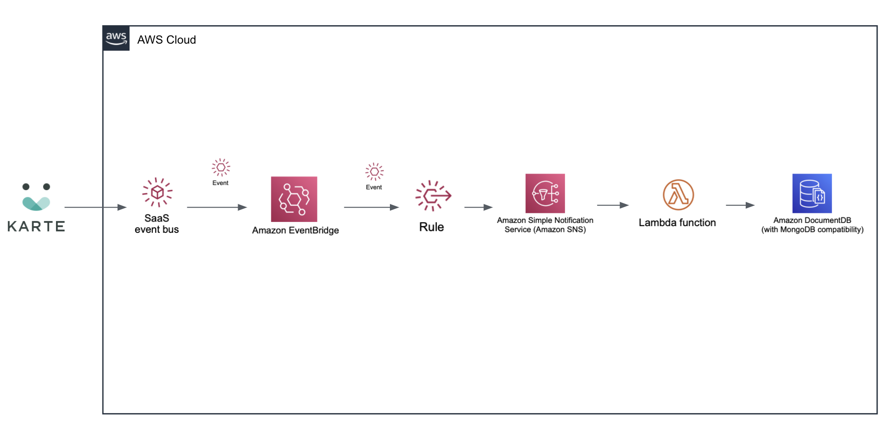

# eventbridge-integration-plaid-karte-documentdb
## Amazon EventBridge Integration Module: Store end-user data in Amazon DocumentDB in real-time 

This Module deploys an integration with AWS DocumentDB, AWS Lambda and AWS SNS for Amazon EventBridge SaaS Partner Integrations with PLAID. 
The solution leverages KARTE's customer service actions to send any end-user's data to the Amazon EventBridge event bus and store the data in Amazon DocumentDB via AWS SNS and AWS Lambda when the events are matched.

With low code, KARTE user data can be stored in real time in various DBs such as Amazon DocumentDB on AWS. By using this data in your system, you can improve the expressiveness of your system more flexibly.




This is a sample code to use this module

```yaml
AWSTemplateFormatVersion: '2010-09-09'
Description: "Write to DocumentDB from KARTE"
Resources:
  KarteToDocumentDB:
    Type: KARTE::EventBridge::DocumentDB::MODULE
    Properties:
      ClusterName: custom-doc
      CollectionName: mycollection
      DBInstanceClass: db.t3.medium
      DBName: mydb
      EventSourceName: "aws.partner/karte.io/XXXX/YYYY/ZZZZ"
      MasterUserPassword: password
      MasterUsername: user
      SecurityGroupIds: 
        - sg-XXXX
      SubnetGroupName: XXXX
      SubnetIds: 
        - subnet-XXXX
        - subnet-YYYY
```

**After creating the Stack in CloudFormation, manually set the SNS as the trigger for the Lambda function you created.**


To post feedback, submit feature ideas, or report bugs, use the Issues section of this GitHub repo.

