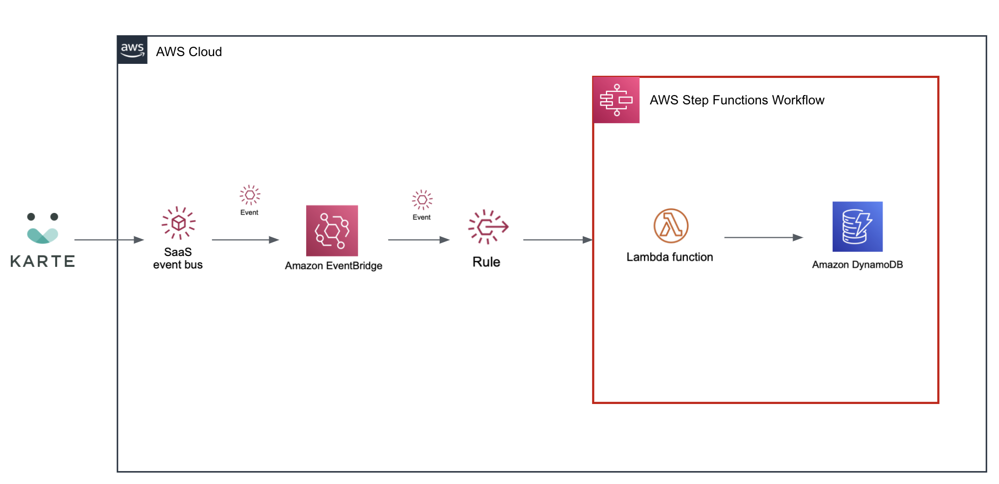

# eventbridge-integration-plaid-karte-dynamodb
## Amazon EventBridge Integration Solution: Store end-user data in Amazon DynamoDB in real-time 

This template deploys an integration with AWS DynamoDB, AWS StepFunction, AWS Lambda and AWS SNS for Amazon EventBridge SaaS Partner Integrations with PLAID. 
The solution leverages KARTE's customer service actions to send any end-user's data to the Amazon EventBridge event bus and store the data in Amazon DynamoDB via AWS SNS and AWS Lambda when the events are matched.

With low code, KARTE user data can be stored in real time in various DBs such as Amazon DynamoDB on AWS. By using this data in your system, you can improve the expressiveness of your system more flexibly.





Your IAM user or role need to have the following IAM policies to deploy.

```
- AmazonDynamoDBFullAccess
- CloudWatchLogdsFullAccess
- AWSStepFunctionFullAccess
- AmazonEventBridgeFullAccess
```

To post feedback, submit feature ideas, or report bugs, use the Issues section of this GitHub repo.

